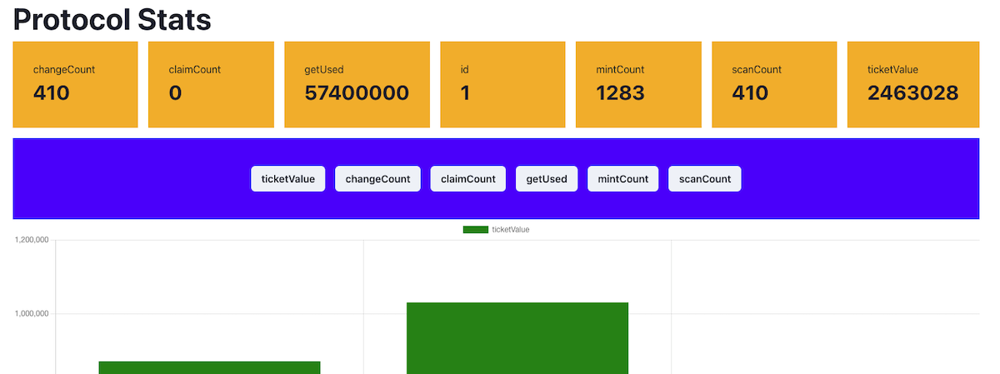

# GET Protocol Subgraph Sample App

> Simple sample application to demonstrate querying the subgraph for on-chain data

This app is an explorer tool for interacting with your local Graph Node. You can use it to test the subgraph by querying against it and plotting the data to a chart to demonstrate it's potential as a visual tool.

The app has been generated using [Create React App](https://github.com/facebook/create-react-app) [charts.js](https://www.chartjs.org/), and Apollo is used as the GraphQL client. Refer to [the Apollo Docs](https://www.apollographql.com/docs/react/data/queries/) for more information on using queries.

## Setup

Install dependencies and start the application in development mode:

- `yarn install`
- `yarn start`

Open [http://localhost:3000](http://localhost:3000) to view it in the browser.

_Note; this requires a local graph-node to be running to serve data. Please refer back to the parent README for instructions)_
